# 笔记模板2

## 1. 文章解决的问题

背景：软件开发中，开发人员会花时间在程序理解上，所以需要代码摘要来描述程序。对开发人员来说写摘要也很耗时，所以需要探索自动代码摘要

传统方法：

* 基于模板：从源代码中提取关键字，然后把关键字放到预定的模板中，生成代码摘要
* 基于信息检索的（IR）：直接用类似的代码的摘要，不进行处理就用？

新方法EditSum：以相似代码的摘要为原型，从原型中提取模式。对于这个方法的神经网络来说，原型的模式告诉神经网络如何说，输入的具体的代码是说什么

## 2. 解决的思路

EditSum由两个模块组成

* 检索模块：输入代码片段，使用信息检索技术从库中检索相似的代码，将检索到的代码片段的摘要作为原型。
* 编辑模块：融合原型中的模式和输入代码的语义信息来形成摘要

例子：

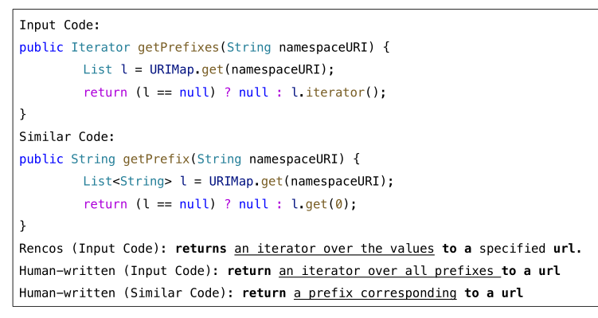

粗体字是模块，下划线是关键字

EDITSUM大致分三个步骤：

1. 选择合适的原型摘要
2. 提取输入代码的语义信息，是根据相似代码和输入代码之间的差异来计算一个编辑向量
3. 将原型中的模式与输入代码的语义相结合

### A.检索模块Retrieve module

这一步是根据给定的代码，将数据库中的找到相似代码的摘要。

那么重要的是找相似性指标，BM25算法：分数越高，相似性越高

计算公式：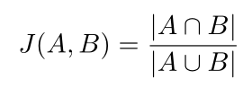

A、B是两个单词集合，ab交集的数量除以ab并集的数量。选择相似性的范围在0.3~0.7

为什么不选择0.7？太过于相似的代码片段不利于修改原型

### B.编辑模块Edit Module

首先利用原型编码器得到原型的向量表示。然后根据两段代码的词法差异计算编辑向量。最后使用摘要解码器对原型表示和编辑向量生成新的摘要

1. 原型编码器：用一个热像量w来映射原型Y中的单词y，$$W^T$$是

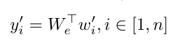

最后就能得到将原型转化为向量的表示。在图片中变成$$y_i$$,输出变成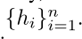

2. 编辑向量z：反映输入代码X和类似代码$$X^‘$$间的语义差异。

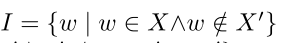

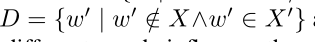

I是要插入的单词，D是类似代码中要删除的单词

下面的方法就是区分两个代码间的语义差异，$$\alpha_w指的是单词w在I中的权重，\Phi(w)指的是单词w的嵌入$$

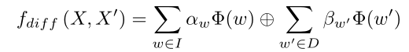

然后再用		

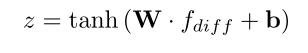

W和b是两个训练的参数

3. 摘要解码器Summary Decoder：

   从z和原型摘要获取新的摘要。

   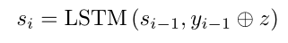

   $$c_i是一个上下文向量，是{h_i}1~n的加权和$$

## 3. 核心知识点或名词定义

word embeddings ：就是单词，但是是单词的表示法

$$\oplus$$指的是串联操作

prototype：库中的摘要

LSTM:长短期记忆（Long short-term memory, LSTM）是一种特殊的RNN

## 4.程序功能说明

架构图

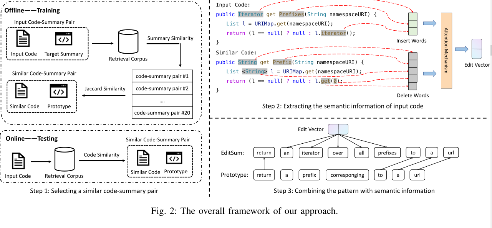

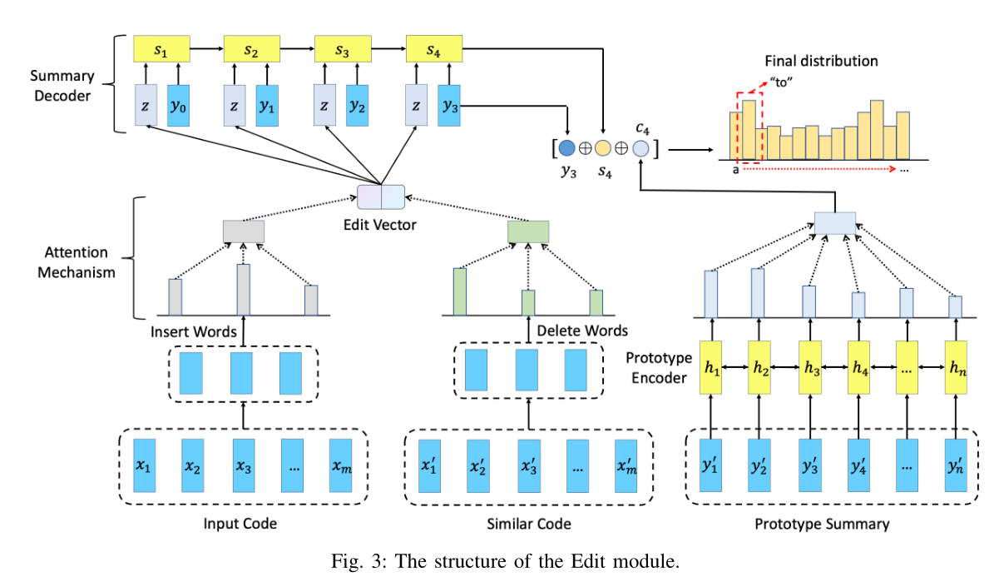

## 5. 存在的问题

## 6. 改进的思路

## 7. 想法来源

