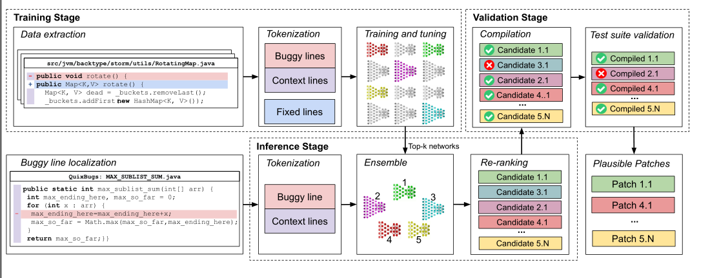

# 笔记模板2

## 1. 文章解决的问题

还是用神经网络来解决修复，上下文的学习是独特的，用两个编码器，一个服务上下文，一个服务错误行代码。然后用了FConv的CNND层来提取更大上下文的分层特征。

## 2. 解决的思路

其中的挑战：1.上下文与错误行的依赖性问题：使用不同的内核大小的卷积层来表示不同粒度的关系，有方法内和语句内的依赖关系

​                        2.自然语言处理就没多少个词汇量，但是代码的词汇量大，大小写的变量就是一个例子

## 3. 核心知识点或名词定义

## 4.程序功能说明

### 1.Training阶段

首先是数据提取，围绕bug行的方法表示bug的上下文

## 5. 存在的问题

## 6. 改进的思路

## 7. 想法来源

