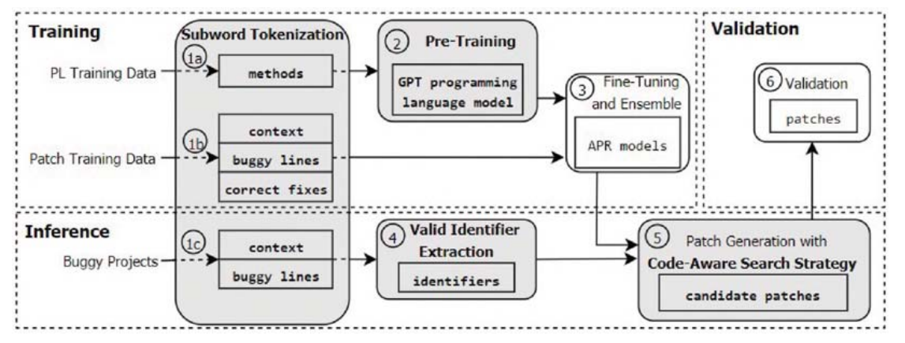

# 笔记模板2

## 1. 文章解决的问题

使用神经机器翻译(NMT)来解决程序修复。CURE不仅改善了搜索空间(更小的搜索空间包含更多正确的补丁)，而且使用了更有效的搜索策略来查找正确的补丁并将其排名更高。

为了实现上述的功能，用了三种技术：

* Programming language models编程语言模型：使用预训练模型生成一个PL（编程语言模型）。利用PL+NMT两个模型组成完整的APR模型，并且针对APR进行微调，适应不同的修复
* Code-aware search strategy代码感知搜索策略：提高编译通过的概率，就能提高正确补丁的概率
* Subword tokenization：为了减少代码的词汇表，缩小搜索空间

## 2. 解决的思路

输入：bug程序与bug出现的位置（行级别）。

#### 1. 概要图

#### 2. 数据训练

PL模型怎么训练的：从开源的java项目中提取百万个方法（数据集1）进行训练。然后CURE为修复任务微调PL模型（数据集2）。

#### 3. 代码表示与标记化

## 3. 核心知识点或名词定义

## 4.程序功能说明

## 5. 存在的问题

基于搜索的修复必须保证修复成分在程序中，但是很多修复成分并不存在。需要单独的词汇库，但是要建一个词汇库是非常庞大的。

## 6. 改进的思路

## 7. 想法来源

