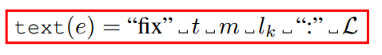

# 笔记模板2

## 1. 文章解决的问题

将程序修复当做自然语言处理一样。将程序修复转化为文本到文本的方法。

## 2. 解决的思路

大致思路：首先提取错误行和两个相邻行组成的错误上下文，然后将错误的所有信息表示为单个文本：

然后TFix把这个文本传给T5，T5这个模型去生成修复代码的新文本。TFix最后搞了一个单一模型，作者提供的数据集有52种错误类型，不是针对每个错误类型搞了对应的模型，而是对总的错误类型搞了一个模型。

### 修复的详细过程

### 3.1 错误如何被检查出来的（External Error Detector）

Tfix的输入是一组代码错误的报告（由代码分析工具 检测器生成）。检测器将输入的程序转化为AST，检测错误。报告是由一个错误类型，一个错误信息，一个位置组成。

详情见原文：

### 3.2 使用T5生成修复

实际的错误文本表示：

T5的任务是查询$$L^{'}$$,来替换L，直到通过检测器。

为了处理词汇太多的问题（oov），采用BPE算法来解决，大致是一种压缩算法。详解https://blog.csdn.net/weixin_38937984/article/details/101723700?utm_medium=distribute.pc_relevant.none-task-blog-2~default~baidujs_baidulandingword~default-0-101723700-blog-118074039.235^v29^pc_relevant_default_base3&spm=1001.2101.3001.4242.1&utm_relevant_index=3

### 3.3 微调T5来合成修复

* 微调目标

  

  该公式由1989年提出

* 如何获取微调数据集

  首先是从github上获取了大量的补丁，得到集合$$C = {p, p^{'}}$$,前者为bug，后者为补丁。需要对其进行处理，因为有些补丁只修复了一部分bug。
  
  如何排除这些补丁：
  
  
  
  它这边也不是完全排除，只是把未修复的地方排除了，已经修复的地方仍然添加到D数据集。
  
  findFixedErrors是找出一个bug程序中正确修复bug的那部分补丁。
  
  computeFix是找出正确修复的操作，这里能够计算p到$$p^{'}$$的操作距离
  
  

## 3. 核心知识点或名词定义

##### 工具：

* ESLint：js的静态分析器，可以输出js运行信息。
* T5：文本到文本转换器

## 4.程序功能说明

## 5. 存在的问题

## 6. 改进的思路

文中提到了多语言微调，我不太清楚，按照我的理解来，举例：现有两个数据集，分别是java和js。我想出一个方法，使得两种语言进行匹配，以此来增强语言之间的知识迁移。或者是将java与js全部统一转化为自然语言来处理，那么就能获取一个统一的修复模型。

这篇文章是做了js转为自然语言处理

或者是这样子：对每一种语言生成对应的编程语言模型(PLMj、PLMJS),然后有一个统一的不基于语言的修复模型(M), 这个两个模型组合成为一个APR模型。

## 7. 想法来源

