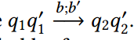
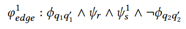
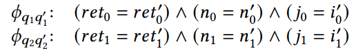
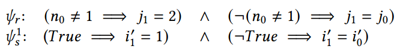
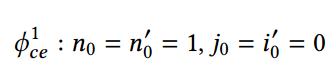
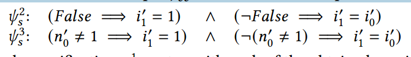
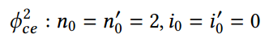
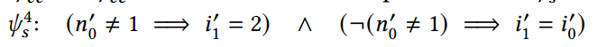
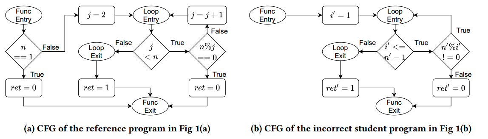
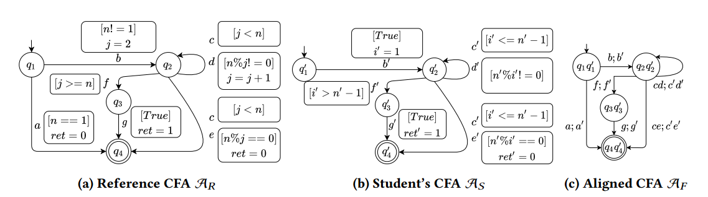

# 笔记模板2

## 1. 文章解决的问题

编程教育时，老师给出自己的参考程序P1（正确的），学生给出自己的bug程序P2。verfix通过这两个程序控制流程的匹配，最后给出一个补丁。该补丁在P2基础上进行修改，在语义上与P1相同。

这里有局限性也有突破性：往常的修复过程是bug + 测试集，现在是正确程序 + 学生错误程序==可不可以我到时候用过拟合补丁 + 正确程序，那么也可以跳过测试集。如此一个场景：==

## 2. 解决的思路

* 问题一：如果要修复，那么错误的程序和参考程序应该有相同的控制流结构？

  普通的解决方案：将通过了所有测试用例的学生程序也加入到参考程序集。

  本文的方法：不做相同的控制结构假设，使用控制流自动机(CFA)进行修复，节点表示程序位置，边表示受保护的命令

  #### 2 overview

  修复算法分三个阶段：设置阶段、验证阶段、修复阶段。后两个阶段同时发生。

  **2.1 设置阶段**

  将参考程序和学生程序建模成CFA，节点为控制流的位置，边为受控制的语句。将两个CFA进行对齐（使用文章中4.1的技术）。举例：$$q$$ $$q^{'}$$是否是行为等价$$q$$ ~ $$q^{'}$$的，如果不等价，那么就会进行修复。

  所以文章的**核心任务**是验证一对对齐的节点是否是相等的。证明语义等价的必要条件是Variable alignment predicate（提供两个程序变量之间的映射，比如例子中的i和j）

  **2.2 验证阶段**

  举例：
  
  为了验证一条边，当$$q_{1}$$ ~ $$q^{'}_{1}$$成立时，执行了$$b;b^{'}$$,使得$$q_{2}$$ ~ $$q^{'}_{2}$$
  
  
  
  验证的公式如下
  
  
  
  其中下面这个代表变量能够语义上相等
  
  
  
  下面的两个公式指的是在$$b;b^{'}$$这两个语句的
  
  
  
  如果验证的公式成立，则$$q_{2}$$ ~ $$q^{'}_{2}$$不成立，那么需要对它进行修复。
  
  **2.3 修复阶段**
  
  使用Z3约束求解器找出求出变量的值使得验证的公式成立，那么求出的值是一个反例。
  
  
  
  然后执行counter-exampleguided inductive synthesis or CEGIS strategy [26]这个策略。
  
  通过修复策略，得到两个候选修复，排除了反例：
  
  
  
  然后再用z3来求解，发现又有反例使得等式成立：
  
  
  
  然后再重复步骤，得到最终的候选修复：
  
  

## 3. 核心知识点或名词定义

#### 例子

​                                                                              普通的控制流图

​                                                                             本文的CFA图

## 4.程序功能说明

## 5. 存在的问题

## 6. 改进的思路

## 7. 想法来源

