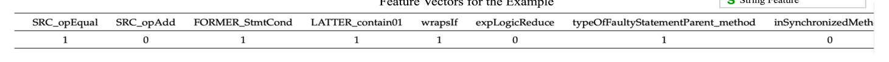

# 笔记模板2

## 1. 文章解决的问题

过拟合补丁的检测系统--ODS

## 2. 解决的思路

通过基于决策树的集成学习模型生成一个补丁是否是过拟合补丁的概率。

每一个补丁，ods会提取202个特征：150个代码描述特征，只针对补丁（变量、操作符、语句、AST操作符）、26个人类编码的修复模式特征、26个上下文语法特征。

### 2.1 特征分类

**代码描述特征：** 分四大类：操作符、变量（全局、局部等）、语句、AST操作。

其中一个代码特征从四大类来看，一共50个。然后从围绕补丁语句提取特性。现在记修改处的语句为SRC特征，修改语句前的最多三条语句为FORMER特征，修改语句后的最多三条语句为Later特征。所以ODS对一个补丁考虑150个特征（50 + 50 + 50）

**修复模式特征：** 26个都是专家提取的模板

**上下文语法特征：** 上下文对于过拟合补丁的判断至关重要。比如一个方法里只有一条语句，然后这条语句刚好是补丁修改过的。那么上下文语法特征就是这个方法了。

### 2.2 特征向量

看例子

### 2.3 Learning Algorithm

使用梯度增强算法，这里只用了一个段来描述。

## 3. 核心知识点或名词定义

举例子：

ARJA中的一个添加操作的补丁。

## 4.程序功能说明

## 5. 存在的问题

## 6. 改进的思路

## 7. 想法来源

