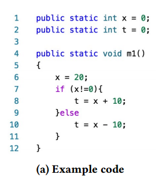

# 笔记模板2

## 1. 文章解决的问题

判断程序之间的相似性。之前的文章通常用语法结构（语法树）来评估程序的相似性，效果不行

## 2. 解决的思路

思路：如果代码特征有更高的抽象，那么测量的语义方面就越准确。deepsim使用控制流和数据流来作为相似性的度量。将控制流和数据流编码为语义矩阵，其中每个元素都是高维稀疏二进制特征向量。通过这种方式，将问题转化为矩阵的相似性。

## 3. 核心知识点或名词定义

**控制流与数据流：**

首先采取三种特征作为基础

1. 变量特征V：对于程序中的一个变量，有int、char等数据类型、修饰符、数组、基本元素等，所以变量特征有19位的特征，表示为$$V = {{V (m),V (o),V (t)}}$$

2. 基本块特征B：normal, loop, loop body, if, if body, switch, switch body有这些块，7维向量

3. 变量与基本块的关系特征$$T$$：文中找出了43种运算操作，用$$I$$。然后用两个变量$$V_{op1}、V_{op2}$$，和一个基本块特征

   $$T={V_{op1},V_{op2},I,B}$$。

   

## 4.程序功能说明

它的CFG有11个变量（9个局部变量和2个静态字段）和6个基本块（包括进入、返回、退出块）。按照三个特征表示方法得出一个矩阵A：

矩阵的介绍：每一行i代表的是一个变量特征，每一列代表一个基本块，而A（i，j）即z轴上的向量代表第三个特征，即第i个变量与第j个基本块的关系T。

有了矩阵就要计算两个矩阵之间的距离。不能简单地用欧几里得距离计算公式，因为不知道哪个T特征更重要。

计算距离这部分用了深度学习：

#### 距离计算

1. 文中把矩阵限制在128*128，不满足该规模的进行0值填充，超过的把部分DFG删除。

2. 对代码语句重新排序。

   

   123行，两个程序是相同的。45两个程序不同。文中忽略变量、基本块之间的顺序，只保留第三种特征的顺序。
   
   不忽略它们，就无法实现1~3行是相同的程序。

## 5. 存在的问题

## 6. 改进的思路

## 7. 想法来源

