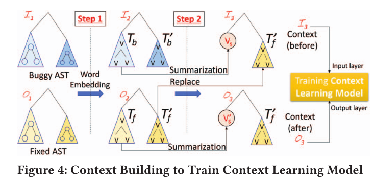

# 笔记模板2

## 1. 文章解决的问题

一个修复在实际过程中可能要修复多处语句，

## 2. 解决的思路

一个bug可能会涉及多个错误（多条语句），训练需要每次固定其他正确的上下文，然后来处理错误的地方。

1. 首先学会上下文

   

   * 第一步将AST节点矢量化
   * 摘要替换，并且把其他正确的上下文放到bug程序中（T'b改成T'f）

## 3. 核心知识点或名词定义

工具：CPatMiner（记录buggy程序与patch的不同）、Glove（将AST节点矢量化为word进行编码）、TreeCaps（获取节点的特征）

## 4.程序功能说明

## 5. 存在的问题

## 6. 改进的思路

## 7. 想法来源

# 8 其他人的笔记

现有基于深度学习的程序修复技术在涉及修复改变了（1）同一个文件或（2）一个文件的不同部分或（3）不同文件中的多条语句时（多语句的集合在文章中称作为hunk），存在局限性：现有方法大多只支持修复单条语句，在修复时只针对目标语句，而其余语句视作为正常的，这显然是不正确的。在本文中，作者提出了一个名为DEAR的深度学习模型以支持对多hunk缺陷修复的支持。

文章所用数据集包括：Defects4J [1]、BigFix.jar [2]和CpatMinder [3]。

文章的Motivation如图1所示。图1所示代码的缺陷体现在：（1）开发人员没有处理UID为空的情况，（2）没有对UID进行大小写转换，（3）没有对password进行hash运算。通过该Motivation可以得到3个观察：

观察1：图1中的bug需要在同一个程序中对多条具有依赖关系的语句进行修改，即：（1）对于line 4的if分支，添加else分支，以处理UID为空的情况；（2）在line 6对UID进行大写转换；（3）在line 11添加hash操作。由此可以看出，对单个语句进行一次调整并不能很好地修复bug。一般来说，一个bug可能需要在同一个修复中对多个语句进行调整。

观察2：对该bug的修复涉及多个AST子树的调整，如对line 4 if语句的修改，就涉及到在if语句的AST子树中，添加else子树。同时，对该bug的修改还涉及到将2条bug语句（line 5和Line 10）调整成4条语句（if的else分支，line 8的return语句，line 6对toUpperCase函数的调用，line 11对passwordHash函数的调用）。由此可见，一个修复可以被分解成多个子树转换。

观察3：bug修复通常依赖于周围代码的上下文。模型要学习line 5 -> line 6的修复，就必须包含line 11的代码。也就是说，修复一个错误语句的正确上下文必须包括另一个错误语句s'的修复代码，而不是s'本身。

模型的训练流程如图2所示。训练的输入为修复前/后的源代码的AST，输出包括：（1）用于上下文学习的模型和（2）用于树转换学习的模型（用于修复过程）。

配对bug和修复子树：一个修复可能涉及对多个函数的修改，在本文中，作者使用分治策略帮助模型学习适当上下文中的修复转换，而不是将整个bug函数与对应的修复配对。文章使用CPatMiner工具[4]导出修复的变化。如果一个子树对应一条语句，则称之为“语句子树”。根据CPatMiner的结果，通过如下规则将bug子树与其修复子树配对：

bug子树（S-subtree）是具有update或delete的子树；

如果S-subtree是delete，则用一颗空的子树作为其修复子树；

如果S-subtree是update，包括：它本身是update、它的子节点被insert、detete或update，使用其对应的修复子树与之配对；

如果S-subtree是insert，且其父节点是另一个S-subtree，使用其父节点S-subtree对应的修复子树作为其修复子树。如果父节点不是S-subtree，则使用一颗空的子树作为其修复子树。

上下文建立：上下文建立的过程如图4所示。对于每一组bug AST 和其修复AST ，对变量执行alpha重命名（alpha renaming，又叫alpha conversion）。对于Step 1，使用GloVe对AST的每一个节点进行词嵌入，以获得对应的AST 和。对于Step 2，需要处理每一对bug和修复的AST子树。首先使用TreeCaps [5]将bug AST的子树及其修复子树转换成向量和。对于其余bug子树，如图4中的，使用其修复子树替换之，以构建修复前的上下文，并作为上下文学习模型中encoder的输入层。而与之对应的则作为修复后的上下文，并用在上下文学习模型中decoder的输出层。

上下文学习：通过具有注意力层和循环学习的、基于树的LSTM进行上下文学习，如图5所示。上下文学习模型包含3层：encoder层、decoder层和attention层。encoder和decoder层基于Child-Sum Tree-based LSTM [6]学习由AST所表现出的修复上下文。与为每个时间步长循环的常规LSTM不同，Child-Sum Tree-based LSTM模型为每个子树循环以捕获结构特征。同时，训练时采用循环训练，通过再训练来加强对输入和输出之间的映射关系的学习。对于（1）错误代码可以以多种方式被修复成不同的修复代码，或者（2）多个错误代码可以被修复成一个修复代码的情况，使用循环训练能够最大程度减少一对多和多对一的关系带来的噪声。

树转换学习：如图6所示，使用与图5所示相同结构的Tree-based LSTM来学习每一个bug S-subtree的转换。对于Step 1，对所有代码token进行词嵌入，bug S-subtree 和修复S-subtree 中每一个节点被转换成向量表示。对于Step 2，使用上下文建立时获取的向量和，通过交叉积对和中每一个节点进行加权。

模型的修复流程如图3所示。

Fixing-together Hunk检测算法：修复多个hunk、多条语句的第一步是检测在同一个补丁中一起修复的有缺陷的hunk。为实现这一目标，作者对BERT预训练模型进行了微调，以学习语句间一起修复的关系。具体来说：

BERT模型的微调：首先微调BERT模型以学习两条语句是否需要一起被修复。假设H是一组在一个bug中被一起修复的hunk的集合，BERT模型的训练数据为所有的H。Step 1：对于H中的一对和，从中取出和，使用BERT对其进行向量化。这里，将(,)作为在同一个补丁中需要被一起修复的语句以用于微调BERT。Step 2：不断重复Step 1以微调BERT。

Hunk检测：这个流程的输入是微调后的BERT模型、缺陷代码P以及测试用例，输出是一组需要被一起修复的hunk。Step 1：使用spectrum-based缺陷定位工具Ochiai [7]从给定的缺陷代码P和测试用例中获取一个缺陷语句列表以及可疑分数。Step 2：缺陷定位工具返回的一个方法中的连续语句被组合在一起形成一系列hunk。Step 3：对于两个hunk 和，其中的每一对语句(,)，使用BERT判断它们需要被一起修复的关系分数r-score；进一步，和需要被一起修复的分数是所有r-score的平均值。通过预设一个门限值来确定和是否需要被一起修复。从检测出的hunk中，建立一组需要被一起修复的hunk。在这组hunk中，任何一条有着高Ochiai返回值的语句会被排名并优先修复。理由是，这样一组包含最可疑语句的hunk应该被优先修复。

多语句扩展算法：上一步检测的结果可能只包含一条语句，因此需要挖掘更多潜在的bug语句。做法是将深度学习与数据流分析相结合：如果一条语句被深度学习模型判断为有问题，则不进行进一步分析；否则，基于数据流分析，将与该语句有数据依赖关系的语句标记为有问题的。

扩展算法：如图7所示，算法的输入是bug语句buggyS，输出是一组连续的语句。首先，通过包含buggyS的N条和后N条语句来提供一个候选语句列表（算法第2行）。本文中默认N = 5。然后使用RNN模型对出buggyS外的所有语句进行判定，判断是否是bug语句（算法第3行）。这里需要提到的是，每条语句用TreeCaps进行编码。对于算法第4行，通过调用第6行的DataDepAnaysis函数，获取buggyS周围的buggyHunk，并考虑buggyS前N条和后N条语句中被RNN模型判别为bug的语句（算法第7行）。接着，从候选列表的中心开始，向上（算法第8行）和向下（算法第9行）逐个检查。在DDExpandHunk方法中，继续通过判断一条语句是否被RNN模型判断为bug或与中心bug语句有数据依赖对buggyHunk进行扩展（算法第13，14行）。算法停止的条件为：遇到没有与buggyS有数据依赖的非bug语句或列表为空（算法第15行）。

基于树的代码修复：基于树的代码修复流程如图8所示。Step 1（识别bug S-subtree）：对于每一个hunk，将其中的代码解析成AST，识别与衍生的bug语句相关的bug S-subtree，如图8中的和。Step 2（嵌入和摘要）：使用GloVe和TreeCaps进行词嵌入和树摘要，获取bug树的上下文，如和被摘要为和。Step 3（预测上下文）：使用训练好的上下文学习模型，在伴随着包括摘要节点的AST的上下文上运行，以预测上下文。生成的AST结构与输入的上下文AST相同，只是摘要节点的改变。例如摘要节点由和变为和。Step 4（加权）：Step 2获取的和用于对和进行加权。和中的每一个节点被表示为该节点原始向量和新的加权向量和间的乘法向量。Step 5（转换预测）：使用训练的树转换模型预测修复子树和。Step 6（移除权重）：移除Step 4附加的权重以获取一个bug的候选修复树，如移除和以获取修复树和。这里需要注意，由于知道交叉向量（）和一个向量（指的应该是），因此可以得到无数个解。为简化结果，假设和分别于和中的节点和垂直，进而通过公式得到未加权的节点，其中表示对求导。至此，能够获得修复树中每一个节点的向量。对于每一个节点，计算其向量和所有token向量列表中向量的cosine相似性。对于候选补丁的生成，通过选择token列表中的token t实现。token t对于修复树中的一个节点的相似性记为score-t。将所有token的score-t相加，得到score-sum，作为候选。根据score-sum为每一个节点选择top-5的候选作为候选。

后处理：在对修复树的各个节点进行组合时，会面临组合爆炸问题，很多候选项对于当前项目中的目标方法是无效的。因此，作者使用了与他们另一篇文章[2]相同的方式设置过滤来淘汰无效的候选项。具体来说，通过alpha重命名将变量名改回普通的Java代码，使用包含作用域中所有有效名称的字典，使用语法检查过滤器删除有语法错误的候选名称，使用名称验证过滤器检查变量、方法和类的有效性。

以上是对文章方法部分的解读。虽然感觉方法不错，但是我还是有很多疑惑：（1）上下文修复模型的输入和输出具体是怎么组织的；（2）树转换学习究竟要学什么，怎么学；（3）基于树的代码修复具体是怎么选择候选token的。个人感觉文章读起来需要一定的预备知识，整篇文章读下来还是很迷。过几天把作者的另一篇文章[2]也学习下，感觉我的疑问在那篇文章中能够得到解答，到时候回来填坑。
