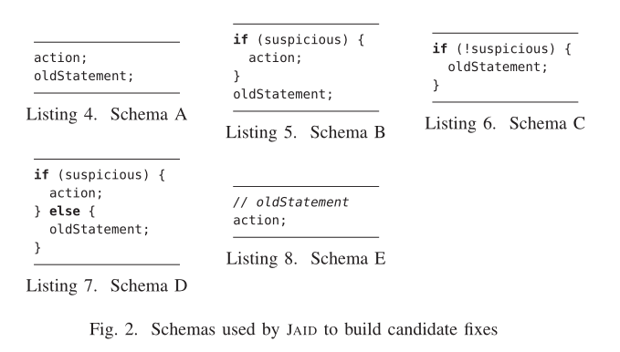

研二新想法：

基础：获得snapshot，以及分辨出过拟合补丁

**第二个创新点的主要目标：** 如何实现过拟合补丁的增强，最基本的目标是使过拟合补丁朝正确的补丁更近一步，高级目标：增强后的补丁是正确的补丁。

**现在的想法：** 由于我们认为是snapshot引发的错误，并且一个测试集里某些测试用例使它成立，另一些测试用例使它不成立。所以做得一切工作都是使得所有测试用例使它不成立。在这个基础上，就限制了一种强化操作，那就是用if语句。

过拟合补丁排序：对A,B,AB的错误的严重性进行排序（严重性：A <B <AB，因为从现有的测试集也好，还是基于实际开发环境来看，一个程序员写出了通过测试用例数量比失败测试用例数量还要少的bug程序时，这个bug程序不如重新写，没有必要修复。所以说，如果引入了回归错误，还不如不修改）。还记得第一个论文里的假设吗==补丁均是能够通过测试套件的，bug程序中通过的测试用例反映了程序的正确行为，失败的测试用例反映了程序的错误行为==，说明bug程序运行通过测试用例，这期间的程序行为是正确的。==为什么对过拟合补丁根据类别排序，因为这是只有我才有的特色，唯一对过拟合补丁实际细分==（为了对比，我需要收集补丁排序的各种算法，一般修复工具都有自己的方法）。

jaid实际修复的n个模式



所以如果有过拟合补丁是B或AB，即引入回归问题，我们必须要把过拟合补丁进行某种程度的复原，使它重新对通过的测试用例有正确的程序行为（必要的）。如何复原？把原来的代码拿过来嘛。

```java
if(snapshot成立)｛
    强化语句可以使用Z3约束求解器
    强化语句；
    过拟合补丁语句；
｝
else{
   //当不成立时，这里放bug程序中的代码，大部分通过的测试用例会运行这个执行路径
   原代码；
}

```

当代码是A类型时，就是直接用

```java
if(snapshot成立)｛
	强化语句；
｝
过拟合补丁语句；
```

现在对布尔表达式进行分析，得出修复的操作：

针对表达式两端都是基本变量int等数字变量：

有固定操作和随机操作

默认操作指涉及a和b以及默认值

* a > b: 默认操作有a = b, a = b-1, a = b / 2;
* a >= b:默认操作有a = b - 1
* a < b: a = b, a = b + 1, a = 2 * b
* a<= b: a = b + 1

随机操作：这里就要涉及程序中的其他变量（叫做强化成分），比如针对表达式a > b，如果有变量，如果c大于1，那么有以下操作

* a = a / c, b = b * c; 
* a = a - c, b = b + c
* a = a - c
* b = b + c

两端是布尔值时，进行类似操作（比较简单）

两端是引用变量时，

默认操作：

* a == b : a = null或者b = null
* a != b : a = b或者b = a

随机操作：

找到其他变量c，

* a == b : a = c 或b = c
* a != b : a = c && b = c


从综述上查到的补丁排序算法：

1. prophet：先对数据集进行训练，然后用一个概率来评估一个补丁，概率越高，补丁优先级越高


1. 针对ARJA这样的APR，减少它的搜索空间。如果有语句能够将snapshot中的元素值发生改变，那么搜索空间把这条语句（或者操作）加入（之前叫修复成分，现在叫强化成分）。然后进行某种操作将snapshot的值修改过来，修改过来之后就可以用过拟合补丁中修改后的语句了

1. 针对ARJA这样的APR，减少它的搜索空间。如果有语句能够将snapshot中的元素值发生改变，那么搜索空间把这条语句

2. 利用神经网络：

   * 训练时：输入：测试用例 + 过拟合补丁 + snapshot 

     ​               输出：正确的补丁

     ​               训练集：JML+JAVA

   * 评估时：输入：测试用例 + 过拟合补丁 + snapshot

     ​               输出：强化后的补丁

     ​               测试集：第一个创新点中正确判断出的过拟合补丁

==退一步，输入可以是测试用例 + buggy程序+ snapshot==

### 深度学习修复或检测过拟合

1. 提供了过拟合补丁的数据：Automated Classification of Overfitting Patches With Statically Extracted Code Features：我们在两个库的基础上实现了ODS特征提取引擎:Coming[36]，提取代码描述特征和上下文语法特征;ADD[32]，提取修复模式特征。这两个工具内部都使用GumTree[14]来计算AST差异。对于ODS分类器，我们使用了现有的基于决策树的集成学习库XGBoost[3]。
1. 常见的模型训练工具：梯度增强算法、