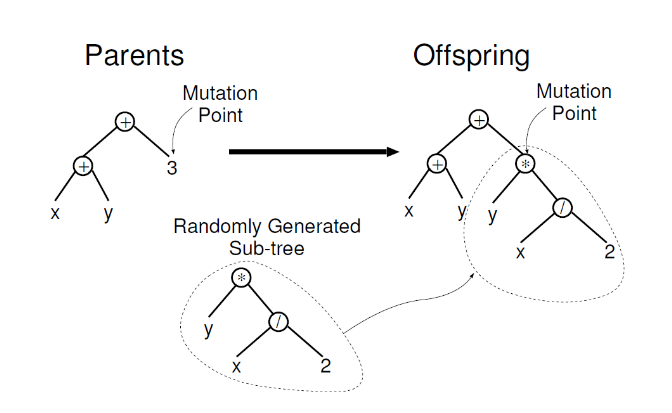
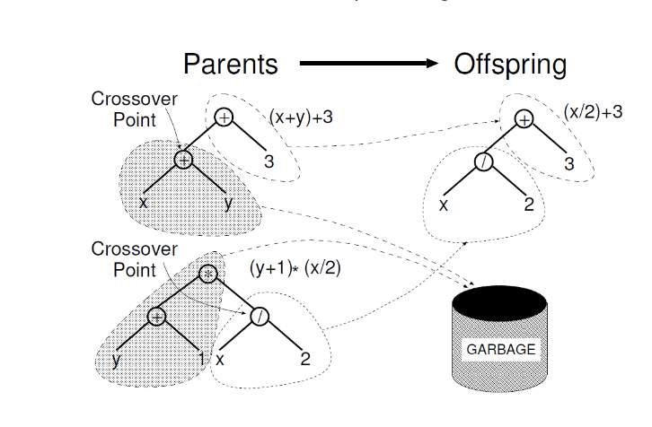
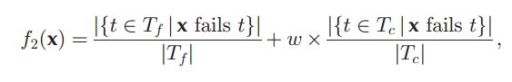
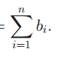

# 过拟合补丁强化

基础：获得snapshot，以及分辨出过拟合补丁

**第二个创新点的主要目标：** 如何实现过拟合补丁的增强，最基本的目标是使过拟合补丁朝正确的补丁更近一步，高级目标：增强后的补丁是正确的补丁。

方法的三个步骤：定位、强化、验证

## 1. 强化

补丁的三种常见的操作：增、删、改

分别是

```java
增：                删：             改：
补丁语句；          空语句；             补丁语句；
原语句；
```

如果有过拟合补丁是B或AB，即引入回归问题，我们必须要把过拟合补丁进行某种程度的复原，使它重新对通过的测试用例有正确的程序行为（必要的）。如何复原？把原来的代码拿过来嘛。

```java
if(snapshot成立)｛
    强化语句；
    过拟合补丁语句；//如果是删除操作，那么这里放空语句
｝
else{
    //当不成立时，这里放bug程序中的代码，大部分通过的测试用例会运行这个执行路径
   原代码；//原代码指的是被删除的语句、被修改的语句，如果补丁是增操作，那么else里面放空语句就行。
}
   原代码；


```

当代码是A类型时，就是直接用

```java
if(snapshot成立)｛
	强化语句；
｝
过拟合补丁语句；
```

## 2.强化语句该怎么实现：

首先要确定一点，从程序表达式的角度判断过拟合，那么强化的方向也应该是程序表达式，即执行强化语句后，使得snapshot不再成立。

在这里选择修复方法：遗传算法（参考ARJA）

#### 1. fault localization

已经被确定

#### 2. Test Filtering

已经被确定，未覆盖$$M_{bug}$$的测试用例均删除，为什么删除：第一个创新点中是为了增加找到正确snapshot的准确性，现在是为了减少适应度评估时间。

#### 3. 强化成分

#### 3.1 强化成分的范围

首先是扩张到整个类进行查找

#### 3.2 强化成分的选择

基于snapshot的变量，即如果snapshot的表达式由int组成，那么就将范围中的int变量加入相关变量。以此类推。

此外，要给每一个相关成分赋一个相关度，例如该变量是组成表达式的变量，称为主变量，那么相关度为1；其余的变量要通过某个公式计算，例如越接近主变量，那么相关度越高

现在有了相关变量，需要确定种子语句。一条语句有越高的相关度之和，那么这条语句作为强化成分的概率越大。

此外对于某些没有相关变量的语句，也可以将它们的变量改成主变量。

### 4. 生成强化补丁

如何表示一个基因？这里参考genprog，用抽象语法树。整个程序用抽象语法树表示，但是突变、交叉都是在强化语句对应的节点中进行的。

突变：



交叉：



复制：

直接复制到下一代

每种操作的概率为1/3

### 5. fitness

由于是从snapshot的角度，那么有两个适应度目标：测试用例通过个数与失败测试用例在强化后snapshot不成立的个数。

测试用例的适应度公式：



snapshot的适应度公式：

执行了if(snapshot)的测试用例，在后面snapshot仍然成立的个数。当个数为0时，说明强化成功。

终止条件：

测试用例通过并且

失败测试用例在强化后snapshot都不通过。

超时、迭代结束
